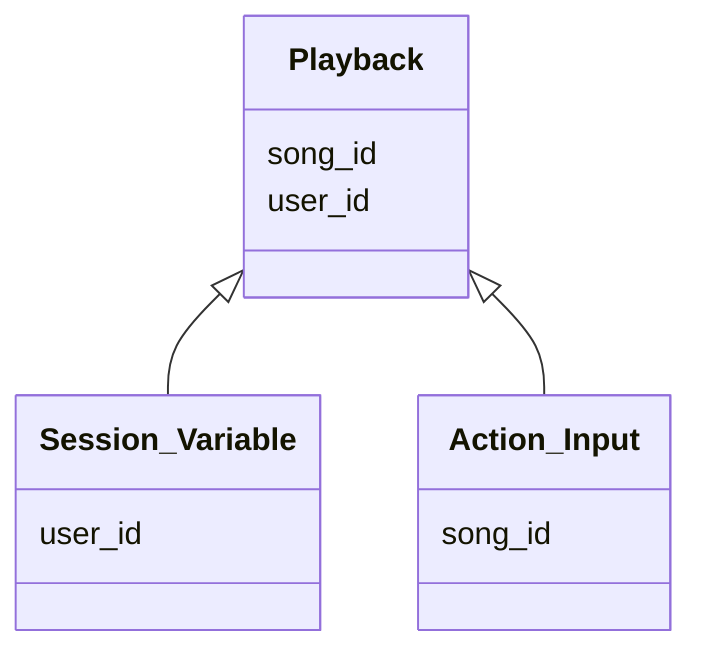

## Server

To run the server for the action and event triggers, navigate to the

## Northwind

### To create the initial environment

- `hasura metadata apply`
- `hasura seed apply`

### Schema definitions for Actions / Event Triggers

## Chinook

### To create the initial environment

- `hasura metadata apply`
- `hasura seed apply`

---

Add Databases
Create Relationships
Add Action
Enable Permissions
Subscribe to user 1
Manipulate with actions

Restify top charts

---

## Actions

### Playback



**Definition**

```graphql
type Mutation {
  playback(song_id: Int): PlaybackResponse
}
```

**Configuration**

```graphql
type PlaybackResponse {
  playback_id: Int!
}
```

**Handler**  
`{{ACTION_BASE_URL}}/playback`

**Request Method**  
`POST`

**Request Body**

```handlebars
{ "song_id":
{{$body.input.song_id}}, "user_id":
{{$body.session_variables.x-hasura-user-id}}
}
```

### Schema definitions for Actions / Event Triggers

## Troubleshooting

If you have conflicts with docker names, this is a bad idea, but will solve the problem.

- Kill running dockers
  `docker stop $(docker ps -q)`
